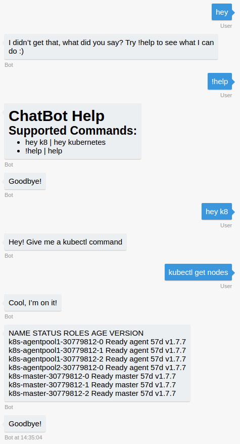

# Azure Bot Framework app for kubectl

This is a small nodejs application using Microsoft Azure bot framework to wrap around `kubectl` commands.  
It demonstrates usage of the bot framework and dialog conversation:

## Usage

* Create a Microsoft Azure Bot on Microsoft bot framework website [here](https://dev.botframework.com)
* Grab the bot app ID and password and keep it in a safe place  

Run: `./run.sh`   

This will prompt you for your app ID and password and run a local bot in docker.  

Download the Azure bot framework emulator and connect to your bot on localhost
